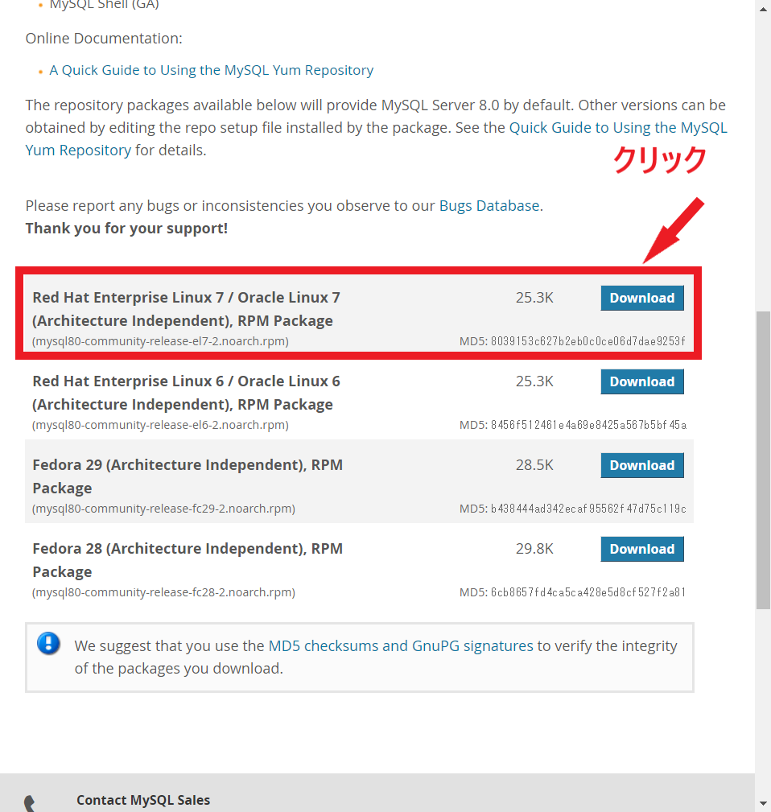
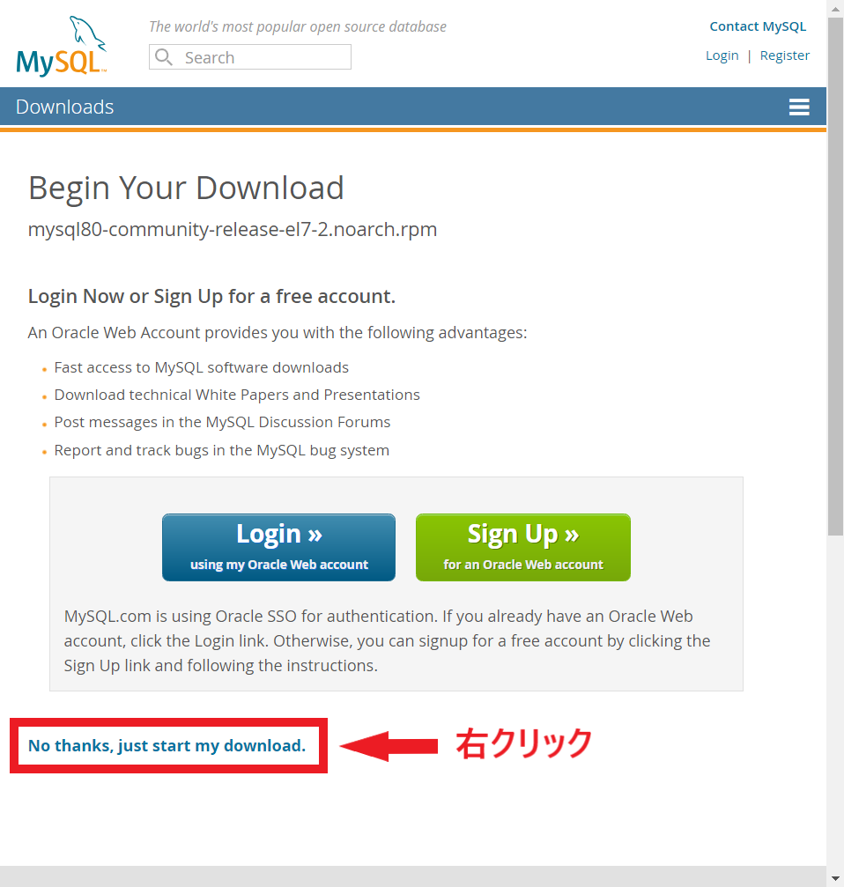
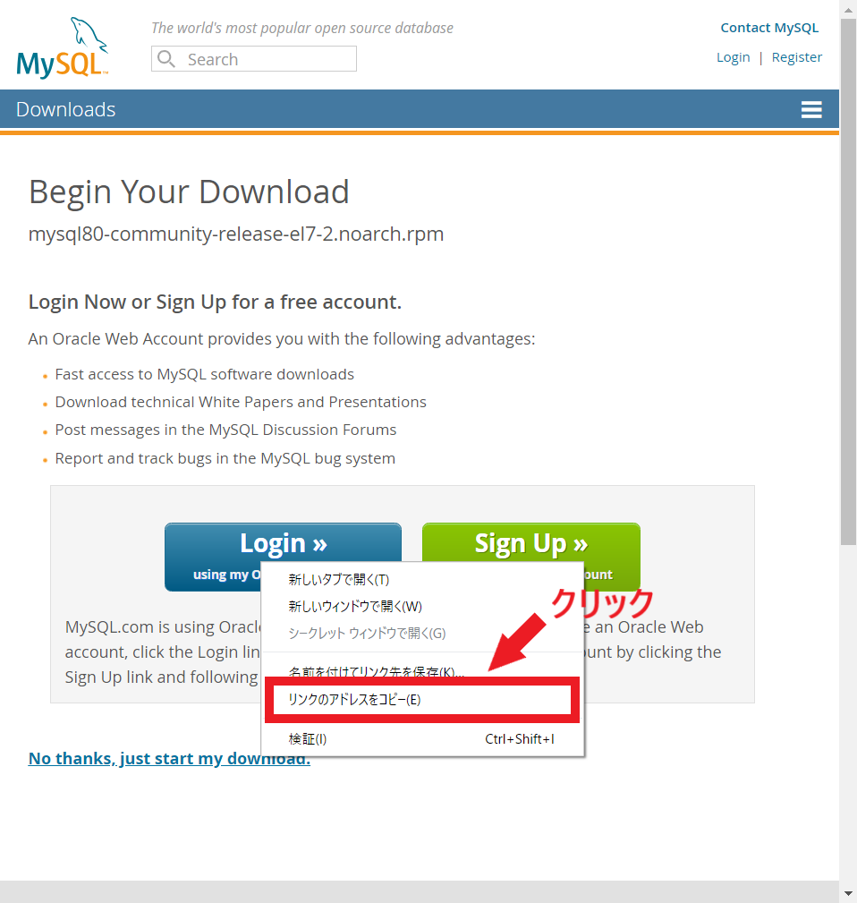

# Knowledge

## 目次

- [CentOS7への各種ソフトウェア(最新バージョン)の導入方法](#centos7への各種ソフトウェア最新バージョンの導入方法)
	- [Node.js](#nodejs)
		- [手順](#手順)
	- [MongoDB](#mongodb)
		- [手順](#手順-1)
	- [MySQL](#MySQL)
		- [手順](#手順-2)
- [エラーの対処法](#エラーの対処法)
	- [npmでモジュールをインストールする際エラーメッセージが出る](#npmでモジュールをインストールする際エラーメッセージが出る)
	- [dotinstallの方法でMongoDBが起動しない](#dotinstallの方法でmongodbが起動しない)
	- [Express入門においてdotinstallの方法で実施するとエラーが発生する](#express入門においてdotinstallの方法で実施するとエラーが発生する)
		- [&#35;20&nbsp;CSRF対策を施そう](#20-csrf対策を施そう)

---

## CentOS7への各種ソフトウェア(最新バージョン)の導入方法

### Node.js

以下のサイトを参考に、現在の安定バージョンである「10.15.3」をインストールする。

参考URL：CentOS 7 Node.js のインストール手順 (yum を利用) - Qiita  
https://qiita.com/daskepon/items/16a77868d38f8e585840

#### 手順

1. yumに対してNode.jsが配布されているリポジトリを追加
    ```
	# 参考ページでは当時の安定バージョン「8.x」系を使用していたため、
	#     https://rpm.nodesource.com/setup_8.x
	# となっていたが、今回は「10.x」系を使用するため、
	#     https://rpm.nodesource.com/setup_10.x
	# とする
	$ curl -sL https://rpm.nodesource.com/setup_10.x | sudo bash -
	```

2. インストール
	```
	$ sudo yum install nodejs
	```

3. バージョン確認
	```
	$ node -v
	```

---

### MongoDB

以下のサイトを参考に、現在の安定バージョンである「4.0.3」をインストールする。

参考URL：Install MongoDB Community Edition on Red Hat Enterprise or CentOS Linux — MongoDB Manual  
https://docs.mongodb.com/manual/tutorial/install-mongodb-on-red-hat/

#### 手順

1. yumに対してMongoDBが配布されているリポジトリの情報を追加する  
`/etc/yum.repos.d/mongodb-org-4.0.repo`というファイルを作成し(root権限のファイル)、リポジトリ情報を書き込む

	sudoで管理者権限でviエディタを開く
    ```
	$ sudo vi /etc/yum.repos.d/mongodb-org-4.0.repo
	```

	リポジトリ情報（`i`キーで挿入モードにし入力。入力完了後、`ESC`キーでコマンドモードにし`:wq`で書き込み終了する）
    ```
	[mongodb-org-4.0]
	name=MongoDB Repository
	baseurl=https://repo.mongodb.org/yum/redhat/$releasever/mongodb-org/4.0/x86_64/
	gpgcheck=1
	enabled=1
	gpgkey=https://www.mongodb.org/static/pgp/server-4.0.asc
	```

2. インストール
	```
	$ sudo yum install mongodb-org
	```

3. バージョン確認
	```
	$ mongodb --version
	```

---

### MySQL

以下のサイトを参考に、現在の安定バージョンである「8.0」をインストールする。

参考URL：
1. MySQL 5.7 を CentOS 7 に yum インストールする手順 | WEB ARCH LABO  
https://weblabo.oscasierra.net/installing-mysql57-centos7-yum/

2. MySQL 8.0 初期設定覚書 - Qiita  
https://qiita.com/nobu-maple/items/3849b2161a21f90ae298

3. CentOS 7 　MySQL8.0 インストールと設定方法（CentOS 7.5） | さなころ…  
https://sanakoro.com/post-721/

4. MySQL :: Download MySQL Yum Repository  
https://dev.mysql.com/downloads/repo/yum/

#### 手順

1. CentOS 7 には mariaDB という MySQL 互換のデータベースサーバーがデフォルトでインストールされている場合があるため、MySQL と競合しないようにアンインストール・データ削除を行う

    ```
	$ sudo yum remove mariadb-libs
	$ sudo rm -rf /var/lib/mysql/
	```

2. 参考URL4へ以下の方法でアクセスし、rpmファイルへのURLをコピペする

    赤枠で囲んだ個所の「Download」ボタンを押下
    

    赤枠で囲んだ「No thanks, just start my download.」リンクを右クリックし、
    

	以下のようにリポジトリ登録用rpmファイルへのURLをコピー（画像はChromeでの例）
    

3. MySQL 公式 yum リポジトリを追加する  

    ```
	$ sudo yum localinstall <2でコピーしたrpmのURL>
	```

4. インストール

    ```
	$ sudo yum -y install mysql-community-server
	```

5. バージョンの確認

    ```
	$ mysqld --version
	/usr/sbin/mysqld  Ver 8.0.15 for Linux on x86_64 (MySQL Community Server - GPL)
	```

6. デーモン「mysqld」をサービスとして登録し、OS起動時に自動的にMySQL Serverが起動するようにする  
また、今後の作業のため手動でデーモンを起動する

    ```
	# mysqld をサービスに登録
	$ sudo systemctl enable mysqld.service
	# 手動でデーモンを起動する
	$ sudo systemctl start mysqld.service
	```

7. MySQLの初期パスワードを以下のコマンドで確認する

    ```
	$ grep 'temporary password' /var/log/mysqld.log
	2018-06-20T10:54:28.112789Z 1 [Note] A temporary password is generated for root@localhost: <初期rootパスワード>
	```

8. 以下コマンドで初期登録を行う

    ```
	$ sudo mysql_secure_installation
	```

    上記コマンドでは以下の順で質問される
	1. rootのパスワード  ->  <7で確認した初期パスワード>
	2. rootのパスワード入力(2回)（英数字、大文字、記号（英数字以外）含む8文字以上のパスワード）
	3. VALIDATE PASSWORD プラグインというプラグインを導入するか -> yと入力してEnter
	4. 「LOW」= 0,「MEDIUM」= 1,「STRONG」= 2 から選択　-> 0,1,2のどれかを入力してEnter
	5. パスワードを変更するか　-> yと入力してEnter
	6. rootのパスワード入力(2回) (パスワードポリシーに沿ったパスワード）
	7. このパスワードで確定して次に進んでいいか  ->  ｙと入力してEnter
	8. 匿名ユーザを削除するか  ->  y と入力してEnter
	9. リモートからのrootログインを禁止するか  ->  y と入力してEnter
	10. テスト用の’test’データベースを削除するか  ->  y と入力してEnter
	11. 設定をリロードして反映するか  ->  Y と入力してEnter

9. MySQLへログイン

    以下コマンドでログイン  
	パスワードは8-2で設定したパスワード

	```
	$ mysql -u root -p
	```

10. パスワードポリシーの変更

    MySQLコンソールで以下を実行

	```
	# VALIDATE PASSWORD プラグインを削除
	mysql> uninstall plugin validate_password;
	# パスワードポリシーを「LOW」に設定
	mysql> set global validate_password.policy=LOW;
	# パスワード文字数を「5」文字に設定
	mysql> set global validate_password.length=5;
	# 新しいパスワードを設定（以後、MySQLにログインする際はこのパスワードを使用）
	mysql> set password = '<パスワードポリシーに則ったパスワード>';
	```

---

## エラーの対処法

### npmでモジュールをインストールする際エラーメッセージが出る

npmでは`package.json`というファイルを用いて、リポジトリ全体の外部モジュールとの依存関係や、リポジトリの各種情報を記録している。  
しかしdotinstallの学習内では`package.json`を生成していないため、npmが「管理用ファイルがないよ」とキレている結果、このエラーメッセージが出ている。  

対処法としてはパッケージのルートディレクトリ(`npm_modules`ディレクトリが生成されるディレクトリ)で、事前に以下のコマンドで`package.json`を作成しておくことで解決する。

```
$ npm init
```

### dotinstallの方法でMongoDBが起動しない

「`mongod`デーモンが起動していないため、アクセスできない」というエラーである。  
従って、以下のコマンドで`mongod`デーモンを起動させてあげる。

```
$ sudo service mongod start
```

### Express入門においてdotinstallの方法で実施するとエラーが発生する

現在Express.jsの最新バージョンが「4.x」であるが、「3.x」で記述が変わっている個所があるので記述しておく。以下のサイトを参考にするとよい。

参考URL：ドットインストール Express入門 Express 4.x でやる時のちがいまとめ。 - かもメモ
https://chaika.hatenablog.com/entry/2015/10/08/171338

また上記URLでも触れていない個所について追記しておく。

#### #20 CSRF対策を施そう

上記サイトでは以下のように修正するよう指摘されているが...

```
...

app.use(cookieParser());
app.use(expressSession({secret: 'secret_key'}));
app.use(csrf());
```

コンソール上に以下のような警告が出てくる。

```
...

Sat, 13 Apr 2019 23:30:00 JST express-session deprecated pass resave option; default value will change at lib\config\express.js:55:11
Sat, 13 Apr 2019 23:30:00 JST express-session deprecated pass saveUninitialized option; default value will change at lib\config\express.js:55:11
```

どうやら省略可能のパラメータ`resave`と`saveUninitialized`のデフォルト値が近々変わると言っている。  
そのため、以下のように`resave`と`saveUninitialized`を設定してあげることで警告が消える。

追加したパラメータの意味は以下の通り。
* `resave`: セッションにアクセスすると上書きされるオプション
* `saveUninitialized`: 未初期化状態のセッションも保存するようなオプション

```
...

app.use(cookieParser());
app.use(expressSession({
	secret: 'secret_key',
	resave: true,			// ← ここ
	saveUninitialized: true		// ← ここ
}));
app.use(csrf());
```